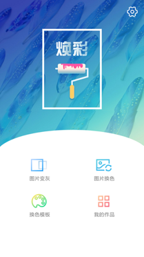
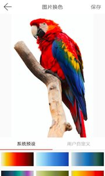
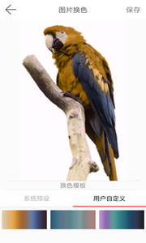
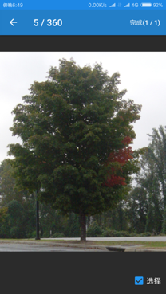
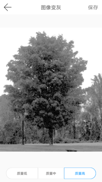
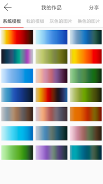

焕彩 Android APP
==============
#### 首页

#### 2018-12-3
服务器到期了，具体参看下面的实现吧

* [图像灰度化实现](https://github.com/freedomofme/Grayscale)
* [色彩转移实现](https://github.com/freedomofme/SampleRecolor)

### 主要功能
1. 图像灰度化 
2. 图像色彩转移 

### 组件

1. 本项目采用Python分别实现了图像灰度化和图像色彩转移。为方便起见，将两者均部署于服务器，以供客户端调用。

	* [图像灰度化实现](https://github.com/freedomofme/Grayscale)
	* [色彩转移实现](https://github.com/freedomofme/SampleRecolor)

2. 项目中采用了OpenCV库和JNI技术进行一些简单的图像编辑操作。使用时注意配置android.mk中的NDK等路径。
3. 采用类Volley库作为网络请求库
3. 项目采用MVP模式开发

### 截图

#### 色彩转移
##### 输入图像

##### 输出图像

#### 灰度化
##### 输入图像

##### 输出图像

#### 结果页

